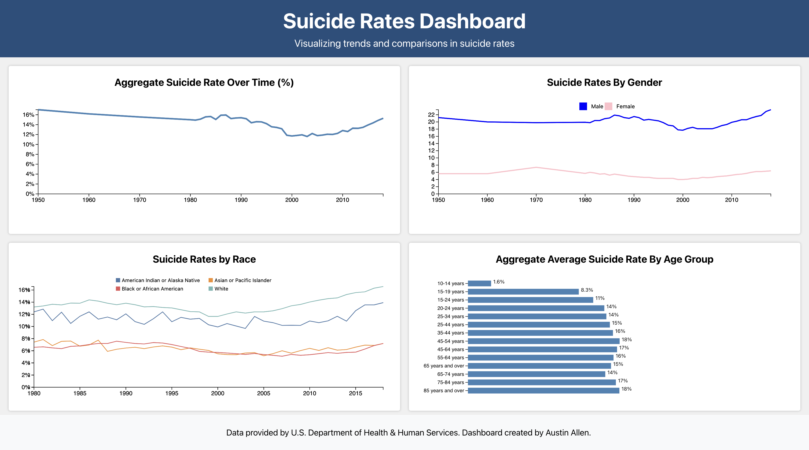

# National Suicide Rates Dashboard

This repository contains the code for the National Suicide Rates Dashboard, a web application that provides a visual analysis of suicide rates in the United States.

## Overview

The dashboard presents various metrics related to suicide rates, including trends over time, comparisons by gender, race, and age group. It aims to provide insights that can help in understanding the patterns and factors associated with suicide rates.

## Getting Started

To get a local copy up and running, follow these steps:

### Frontend Setup

1. Clone the repository: `git clone https://github.com/otonomee/NationalSuicideRatesDashboard.git`
2. Navigate to the project directory: `cd NationalSuicideRatesDashboard`
3. Install dependencies: `npm install`
4. Start the application: `npm start`

The application will start running at `http://localhost:3000`.

### Backend Setup

The backend of this application is built with Flask and uses SQLite for the database. Here's how to set it up:

1. Ensure that Python is installed on your machine. You can download it from the [official Python website](https://www.python.org/downloads/).
2. Navigate to your project directory and create a virtual environment using the following command: `python3 -m venv venv`
3. Activate the virtual environment:
   - On Windows: `venv\Scripts\activate`
   - On Unix or MacOS: `source venv/bin/activate`
4. Install the required Python packages using pip: `pip install flask flask_cors`
5. Start the Flask server using the following command: `python app.py`

The server will start running at `http://localhost:5000`.

## Contributions

Contributions are welcome! If you have suggestions for improvements, please open an issue to discuss them.

## License

This project is licensed under the MIT License.
